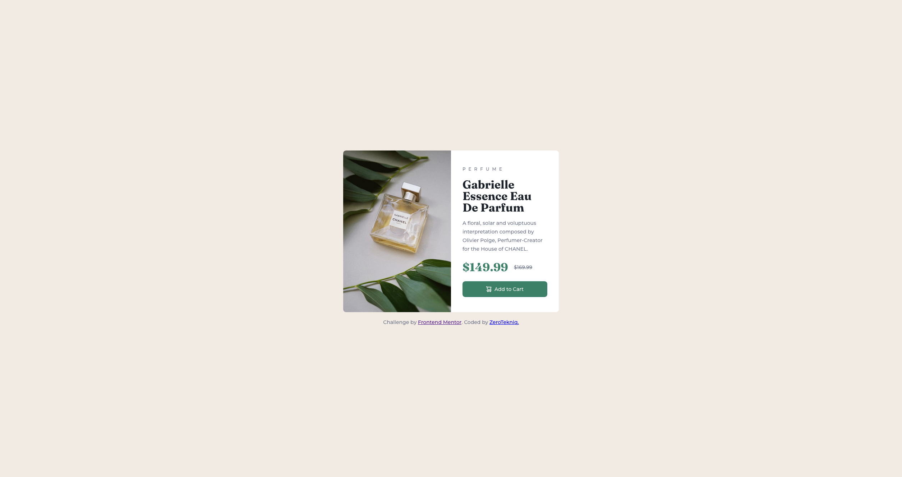

# Frontend Mentor - Product preview card component solution

This is a solution to the [Product preview card component challenge on Frontend Mentor](https://www.frontendmentor.io/challenges/product-preview-card-component-GO7UmttRfa). Frontend Mentor challenges help you improve your coding skills by building realistic projects. 

## Table of contents

- [Overview](#overview)
  - [The challenge](#the-challenge)
  - [Screenshot](#screenshot)
  - [Links](#links)
- [My process](#my-process)
  - [Built with](#built-with)
  - [What I learned](#what-i-learned)
  - [Continued development](#continued-development)

## Overview

### The challenge

Users should be able to:

- View the optimal layout depending on their device's screen size
- See hover and focus states for interactive elements

### Screenshot



### Links

- Solution URL: [Add solution URL here](https://github.com/ZeroTekniq/Product-preview)
- Live Site URL: [Add live site URL here](https://zerotekniq.github.io/Product-preview/)

## My process

### Built with

- Semantic HTML5 markup
- CSS custom properties
- Flexbox
- CSS Grid
- Mobile-first workflow
- Responsive design

### What I learned

Learned about pre-processors and used SASS in the project. Also learned a bit more about CSS GRID and CSS resets. Also learned about the picture element and using srcset to change an image based on parameters. Went a little hard on the file structuring, but I think it may help later in future larger projects.

```html
<picture class="grid__image">
  <source media="(min-width: 37.5rem)" srcset="./images/image-product-desktop.jpg" alt="Gabrielle Essence Eau De Parfum">
  
</picture>
```
```scss
$montserrat: "Montserrat", sans-serif;
$fraunces: "Fraunces", serif;
```

### Continued development

Would like to focus on more layout techniques and use SASS more. 

